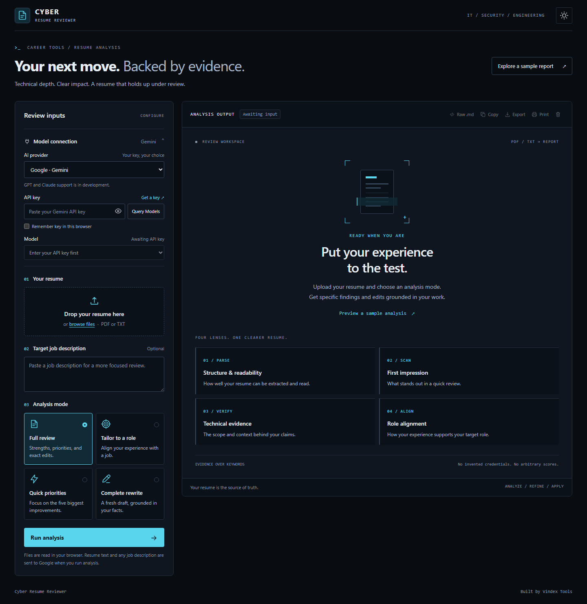

# Cyber Resume Reviewer — Agentic IT & Infosec Review

> [!NOTE]
> **Credits:** Built by **Vindex Tools**, using a modified version of the [Cyber Resume Reviewer Skill](https://github.com/mubix/cyber-resume-reviewer-skill) originally created by [Rob Fuller (Mubix)](https://github.com/mubix).

A sleek, privacy-first web application designed for IT and cybersecurity professionals to receive evidence-led resume reviews, job description alignment, and exact technical bullet transformations.

Gemini is the default provider; use your own Gemini API key. OpenAI (GPT) and Anthropic (Claude) support is in development and unavailable in the provider selector. The shared review instructions come from `skill/SKILL.md`, alongside the selected deliverable, resume text, and optional job description. Vindex Tools' adaptation of the [Cyber Resume Reviewer Framework](https://github.com/mubix/cyber-resume-reviewer-skill) (v4.1) focuses on verifiable technical achievements rather than keyword stuffing or arbitrary scores.

---

## 🌟 Key Features

### 🛡️ 100% Client-Side Execution & Privacy
- **Zero Backend:** Runs entirely in your browser.
- **In-Browser Document Parsing:** PDF parsing is performed locally via `PDF.js` (v3.11); plain text (`.txt`) is read directly via the browser File API.
- **Direct REST Calls:** Requests go from your browser to the selected provider's official API. No intermediate proxy, database, or analytics tracking.
- **Local Key Storage:** Keys stay in memory unless you enable **Remember key** for that provider. Each provider has separate storage and a masked input. Existing saved Gemini keys are migrated automatically.

### 🤖 Intelligent Model Querying & Selection
- **Live Discovery:** Gemini is selected automatically. Enter its key and click **Query Models**. The app loads the account's model list, including additional pages, and filters for text review models. It does not invent model IDs or assume a fixed latest model.
- **Gemini Defaults:** Newer stable Gemini versions appear first, with Flash preferred at the same version. An existing usable selection is preserved. Older and preview models remain selectable because account access can differ.
- **Unavailable Models:** If Gemini lists a model but rejects it as retired or unavailable for your account, the app disables that model for the current key and session. It offers a button to select Google's suggested replacement only when that model is in your returned list, plus a model-list refresh action. You explicitly run the next analysis; the app does not automatically retry a paid request. Changing the key or reloading clears this session's rejected-model cache.
- **Provider Isolation:** Keys are stored separately per provider. Previously saved GPT or Claude preferences fall back to Gemini without reusing those keys. Changing a key invalidates its old model list. Late responses from a previous query cannot replace the current models.
- **Fault-Tolerant:** A failed refresh preserves an already loaded list for the same key. Authentication, quota, network, empty-list, timeout, and incomplete-generation errors are shown without changing to another model or provider.

### AI providers

| Provider | Status | Model discovery | Review endpoint | API key |
| :--- | :--- | :--- | :--- | :--- |
| Google · Gemini | Available · default | `GET /v1beta/models` | `generateContent` | [Google AI Studio](https://aistudio.google.com/app/apikey) |
| OpenAI · GPT | In development · disabled | `GET /v1/models` | Responses; Chat Completions for legacy/chat-only models | [OpenAI Platform](https://platform.openai.com/api-keys) |
| Anthropic · Claude | In development · disabled | `GET /v1/models` | Messages | [Claude Console](https://platform.claude.com/settings/keys) |

API billing and access are separate from consumer chat subscriptions. A model appearing in the list does not guarantee sufficient quota to generate a review. OpenAI's list does not supply endpoint capabilities, so the app filters known text-model families and excludes specialized image, audio, search, and coding endpoints.

The app sends the shared skill as instructions; it does not install native provider skills or execute the skill's linked scripts and reference files remotely. Markdown cleanup, report viewing, copying, exporting, and printing are shared across all providers.

This is a browser-based, bring-your-own-key tool. Only enter keys on a copy you trust; browser keys are accessible to scripts on that page, and remembered keys are not encrypted. Claude requests include the browser-access header used by Anthropic's SDK. If a provider or network blocks direct browser requests, the app reports the connection failure; it does not send credentials through a third-party proxy.

API references: [OpenAI model listing](https://developers.openai.com/api/reference/resources/models/methods/list), [OpenAI Responses](https://developers.openai.com/api/reference/cli/resources/responses/methods/create), [Claude model listing](https://platform.claude.com/docs/en/api/models/list), [Claude Messages](https://platform.claude.com/docs/en/api/messages/create), [Gemini models](https://ai.google.dev/api/models), and [Gemini generation](https://ai.google.dev/api/generate-content).

### 🎯 Evidence-Led Review Framework
Evaluates candidate documents through four core evaluation lenses:
1. **Machine-Read:** Document extraction, structure, and readability checks.
2. **Human-Skim:** First-impression hierarchy, certifications, and high-impact placement.
3. **Human-Believe:** Technical authenticity, tooling context (distinguishing *operated* vs. *supported* vs. *led*), and verifiable metrics.
4. **Human-Act:** Direct alignment with target roles, employer expectations, and gap bridging.

### 📋 4 Tailored Review Objectives
- **Full Review & Assessment:** Comprehensive fit critique, evidence mapping, prioritized technical findings, and exact bullet replacements.
- **Tailor to Job Description:** Maps job requirements directly to candidate achievements, highlighting confirmed evidence and identifying missing scope.
- **Quick Priorities:** Fast-track delivery of the top 5 high-impact findings and immediate technical bullet repairs.
- **Complete Rewrite:** Complete refreshed resume draft preserving authentic candidate facts without hallucinating unverified claims.

### 🧠 Intelligent Guardrails & Temporal Grounding
- **Dynamic Calendar Anchoring:** Automatically injects the real-world calendar date and year into the model's context, preventing AI hallucination from flagging present or recent roles (2024–present) as "future dates".
- **Strict Anti-Self-Talk Filter:** Enforces silent validation reasoning and automatically strips internal drafting scratchpads, verification audits, and self-checks (e.g., `*Check:* Did I invent metrics?`), leaving only crisp, candidate-facing feedback.
- **Instruction Fallback:** If the local skill file cannot be loaded, all providers receive the same built-in fallback instructions. Generating a review still requires an internet connection.

### 📊 Executive Report Viewer & Productivity Tools
- **Dual-View Toggle:** Switch between a styled **Formatted Document View** (with executive print headers, responsive tables, and color-coded Before/After diff tags) and a **Raw Markdown View** (`.md`).
- **Export Capabilities:**
  - One-click copy formatted Markdown to clipboard.
  - Export report as a standalone `.md` document.
  - Dedicated print stylesheet for clean **Save as PDF** or physical printing.
- **Instant Demo Mode:** Append `?demo=1` to the URL to instantly preview a sample executive report without an API key or resume upload.

### 🎨 Cyber / Tech Workspace
- **Theme Modes:** Graphite dark theme by default, with cyan accents and an optional cool light theme. Your choice is saved across sessions.
- **Technical workspace:** Compact panels, sans-serif headings, monospace labels, and a structured analysis viewer adapt to mobile, tablet, and desktop screens.
- **Accessible controls:** Keyboard-operable review choices, visible focus indicators, reduced-motion support, and report tools that activate when a result is available.
- **Model connection:** API key and model settings live in a collapsible section at the top of the input panel, above the resume upload. Sample reports are linked from the page introduction and empty report.
- **Toast Alerts:** Non-blocking notifications for uploads, copies, and state changes.

---

## 🚀 Quick Start

### 1. Prerequisites
- A modern web browser (Chrome, Edge, Firefox, Brave, Safari).
- **Recommended:** Get a free Gemini API key from [Google AI Studio](https://aistudio.google.com/app/apikey). You can use the [Gemini API free tier](https://ai.google.dev/gemini-api/docs/billing) with supported models, subject to its rate limits and available quota.

### 2. How to Run Locally

Because the application fetches the framework instructions dynamically from `skill/SKILL.md`, run it using any lightweight local server (to comply with browser CORS policies for local files):

#### Option A: Python (Pre-installed on most systems)

    python -m http.server 8000

Navigate to: **[http://localhost:8000](http://localhost:8000)**

#### Option B: Node.js / npx

    npx serve

#### Option C: VS Code Live Server
Right-click `index.html` and select **"Open with Live Server"**.

#### Option D: Static Hosting
Deploy directly to GitHub Pages, Cloudflare Pages, Netlify, or Vercel with zero backend configuration needed.

---

## 📖 Step-by-Step Usage

1. **Enter Your Key:** Gemini is selected by default in **Model connection**. Enter your Gemini API key. GPT and Claude are marked **In development** and cannot be selected.
2. **Select Model:** Click **Query Models**, then select a returned text model. Model discovery must complete before running analysis.
3. **Upload Resume:** Drag & drop or click to upload your resume (`.pdf` or `.txt`).
4. **(Optional) Target Job Description:** Paste a target cybersecurity job description (e.g., SOC Analyst, Cloud Security, AppSec, GRC, PenTester) to enable custom requirement mapping.
5. **Select Review Objective:** Choose between *Full Review*, *Tailor to JD*, *Quick Priorities*, or *Complete Rewrite*.
6. **Click Run analysis:** Review the candidate-facing assessment, copy the markdown, or export to PDF.

---

## 🏗️ Architecture & Workflow

1. **Input & Local Extraction Layer**
   - **Candidate Resume:** Parsed locally in browser memory via `PDF.js` (`.pdf`) or Web File API (`.txt`).
   - **Target Job Description:** Optional JD input for targeted cyber capability mapping.
   - **Dynamic Temporal Grounding:** Automatically computes and injects today's real-world calendar date/year so recent experience is never flagged as "future dates".
   - **Framework Instructions:** Loads `skill/SKILL.md` dynamically (with automatic fallback prompt).

2. **Inference & Intelligence Layer**
   - **Direct REST Connection:** `providers.js` handles authentication, pagination, request formats, and response parsing for `generativelanguage.googleapis.com`, `api.openai.com`, and `api.anthropic.com`.
   - **Dynamic Model Selection:** The selected model comes from the selected provider's live model list. No automatic cross-provider fallback occurs.

3. **Sanitization & Executive Presentation Layer**
   - **Direct Output Filter:** Strips AI self-checks, drafting thoughts, and verification checklists.
   - **Dual-Mode Report Viewer:** Toggle between Formatted Executive View (with Before/After diff tags) and Raw Markdown (`.md`).
   - **Export Tools:** One-click copy, download `.md` file, or save/print as PDF.

---

## 🔒 Privacy & Security

| Factor | Implementation |
| :--- | :--- |
| **Document Processing** | Original files are parsed in the browser. Extracted resume text and the optional job description are sent to the selected provider on analysis. |
| **API Transmission** | HTTPS directly to the selected provider; keys are sent in authentication headers. |
| **API Key Storage** | In memory by default; optional unencrypted `localStorage`, isolated per provider. |
| **Data Retention** | This app adds no analytics or server storage. Provider policies apply to API requests. OpenAI requests use `store: false`. |

---

## 🛠️ Advanced: CLI Framework Scripts

The repository also includes the original command-line tools in `skill/scripts/`:

- **`analyze_resume_text.py`**: Command-line text analyzer for candidate signals and role evidence:

      python skill/scripts/analyze_resume_text.py --resume resume.txt --jd jd.txt

- **`render_report.py`**: Headless PDF report renderer from Markdown:

      python skill/scripts/render_report.py review.md review.pdf

- **`validate_report.py`**: Validates report schemas and section structures.

Provider adapter checks run without API keys or network requests:

    node --test tests/providers.test.cjs

Browser regression checks cover Gemini model selection and recovery with mocked API responses (requires Node.js 22+ and Chrome/Chromium; set `CHROME_PATH` if needed):

    node tests/browser-model-recovery.cjs
